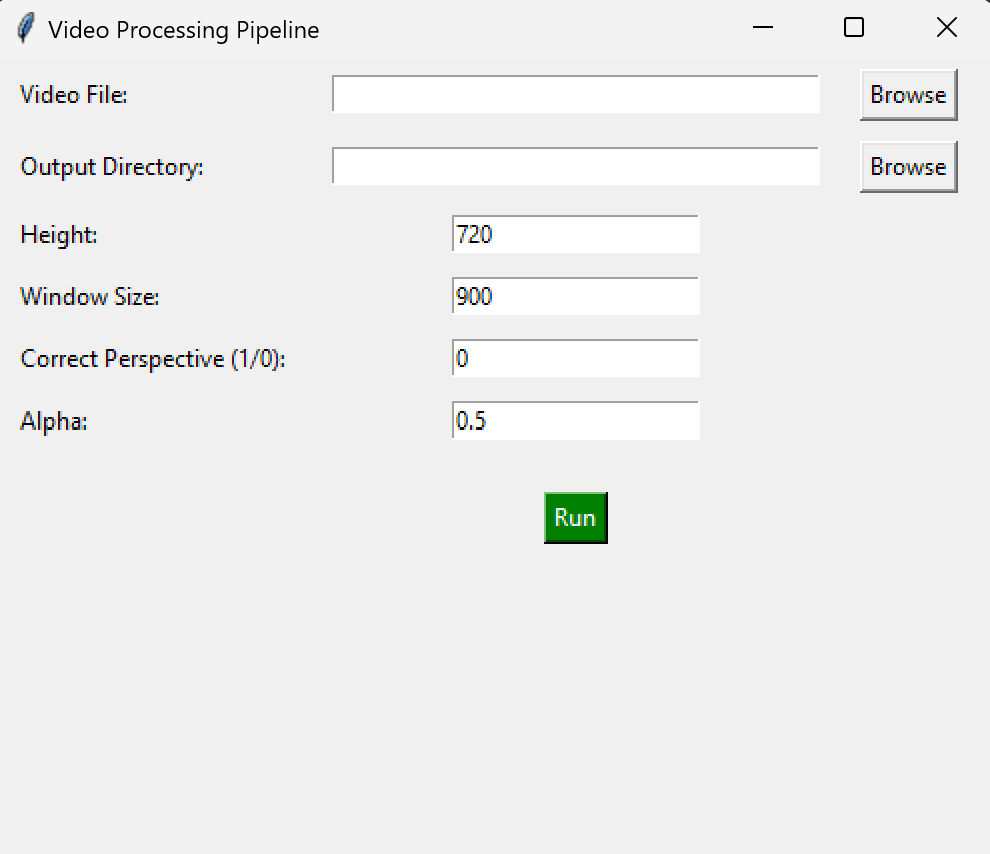
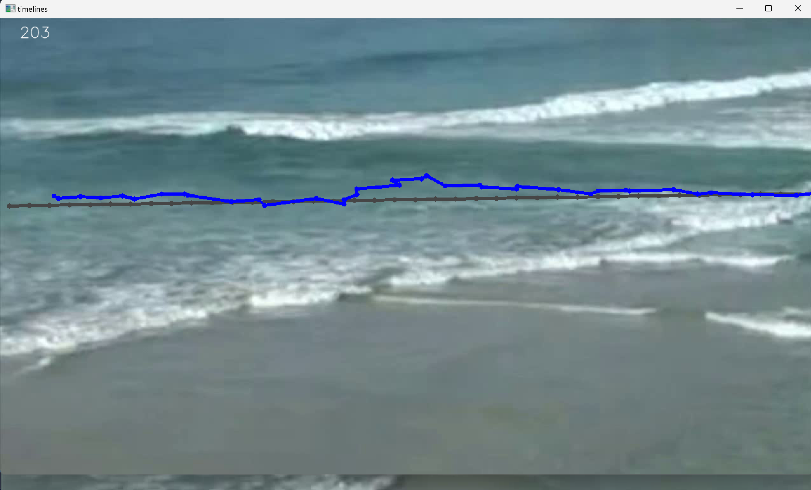

# RIP Waves - Rip Currents Detection

This repository contains a project that detects rip currents from video footage using optical flow algorithms and timelines visualization. The project employs OpenCV for computer vision tasks and utilizes optical flow tracking to visualize the movement of rip currents.

## Features

- **Video Processing**: The program reads video files, processes frames, and outputs an annotated video.
- **Perspective Correction**: Allows users to select a region of interest in the video to apply a bird's-eye view transformation.
- **Optical Flow**: Tracks the movement of specific points in the video to visualize flow patterns.
- **Timelines**: The program draws and updates timelines that show the movement of tracked points in the video.

## Images

## Prerequisites

Before running the project, make sure you have the following installed:

- Python 3.x
- OpenCV
- NumPy
- Matplotlib
- PIL (Pillow)

